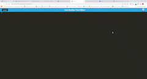

# JATE - Just Another Text Editor

## Description

## Table of Contents
-[Description](description)
-[Installation](#intstallation)
-[Usage](#usage)
-[Deployed Link](#deployed-link)
-[Demo](#Demo)
-[License](#license)
-[Contributors](#contributors)

## Installation
Clone the project and run the command:

```
npm install
```

Then run the command:
```
npm run start:dev
```

## Usage
Type the following command in the terminal:

```
npm run start
```

In Insomnia you can then use the https://localhost:3000/ to run the application.

## Deployed Link

## Demo


## License
MIT License

## Contributors
This app was created by Aidan Reynolds 
Github: https://github.com/areyno20
