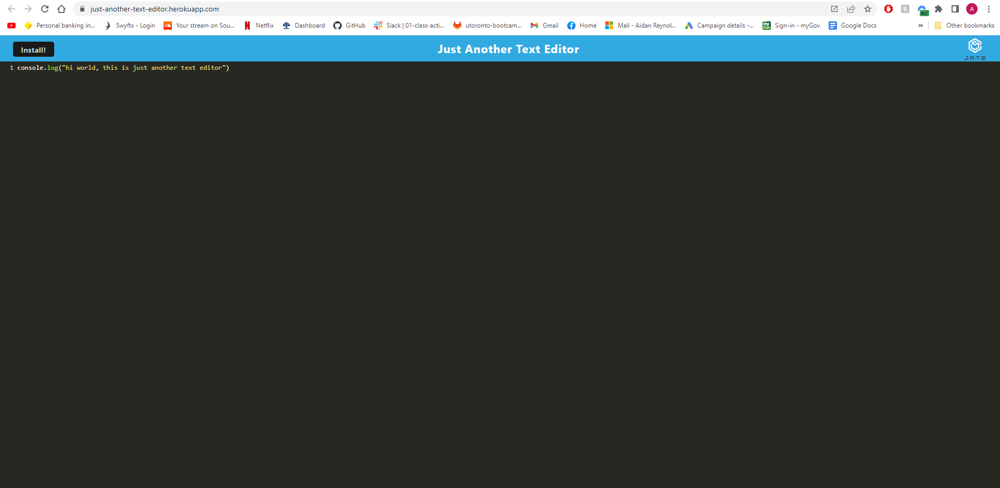

# JATE - Just Another Text Editor

## Description
This application is a simple text editor that can be used offline. It uses an existing text editor applicatio  but adds certain funcionalities that were not present prior.

## User Story
```
AS A developer
I WANT to create notes or code snippets with or without an internet connection
SO THAT I can reliably retrieve them for later use
```
## Acceptance Criteria
```
GIVEN a text editor web application
WHEN I open my application in my editor
THEN I should see a client server folder structure
WHEN I run `npm run start` from the root directory
THEN I find that my application should start up the backend and serve the client
WHEN I run the text editor application from my terminal
THEN I find that my JavaScript files have been bundled using webpack
WHEN I run my webpack plugins
THEN I find that I have a generated HTML file, service worker, and a manifest file
WHEN I use next-gen JavaScript in my application
THEN I find that the text editor still functions in the browser without errors
WHEN I open the text editor
THEN I find that IndexedDB has immediately created a database storage
WHEN I enter content and subsequently click off of the DOM window
THEN I find that the content in the text editor has been saved with IndexedDB
WHEN I reopen the text editor after closing it
THEN I find that the content in the text editor has been retrieved from our IndexedDB
WHEN I click on the Install button
THEN I download my web application as an icon on my desktop
WHEN I load my web application
THEN I should have a registered service worker using workbox
WHEN I register a service worker
THEN I should have my static assets pre cached upon loading along with subsequent pages and static assets
WHEN I deploy to Heroku
THEN I should have proper build scripts for a webpack application
```

## Table of Contents
-[Description](description)
-[User Story](#user-story)
-[Acceptance Criteria](#acceptance-criteria)
-[Installation](#intstallation)
-[Usage](#usage)
-[Deployed Link](#deployed-link)
-[Demo](#demo)
-[License](#license)
-[Contributors](#contributors)

## Installation
Clone the project and run the command:

```
npm install
```

Then run the command:
```
npm run start:dev
```

## Usage
Type the following command in the terminal:

```
npm run start
```

In Insomnia you can then use the https://localhost:3000/ to run the application.

## Deployed Link

## Screenshot


## License
MIT License

## Contributors
This app was created by Aidan Reynolds 

Github: https://github.com/areyno20
